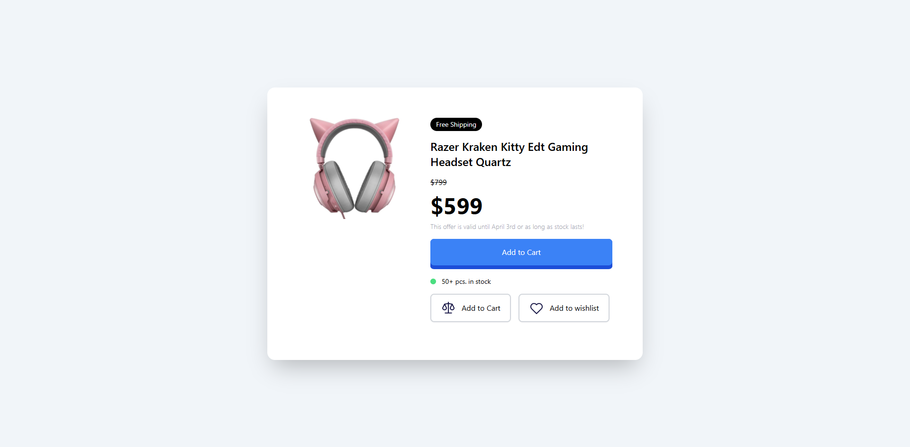
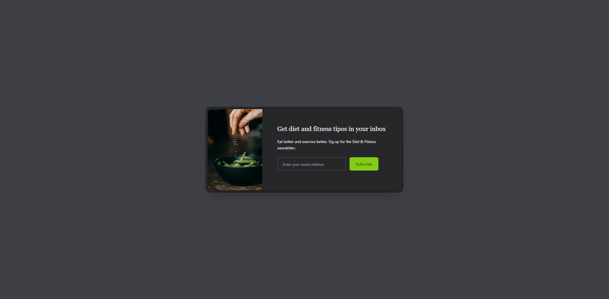
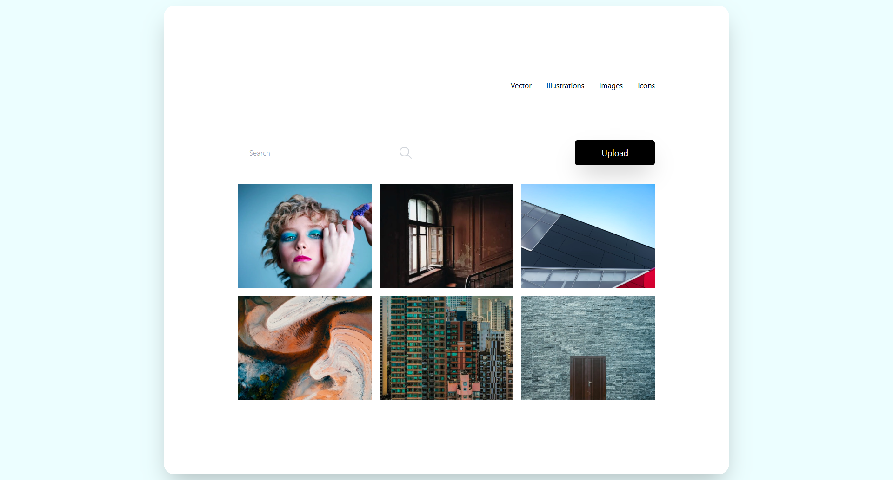
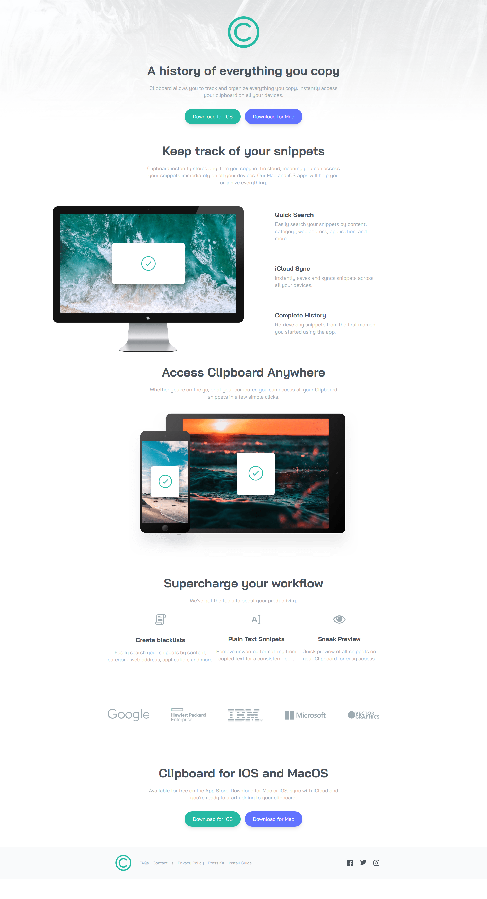
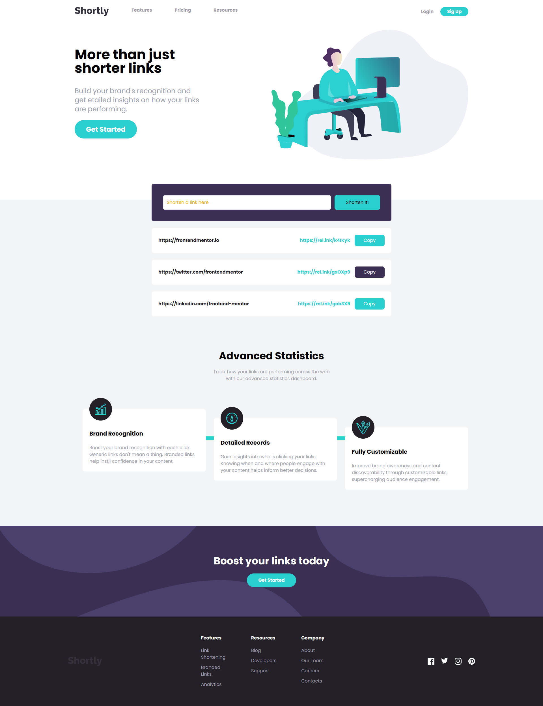
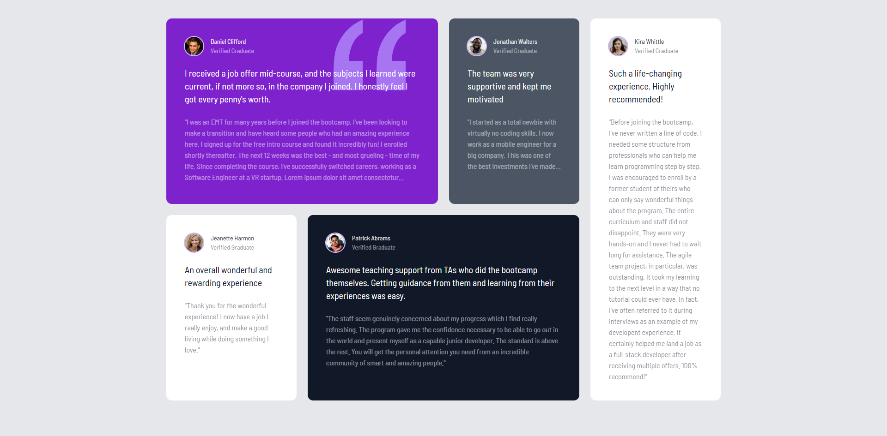
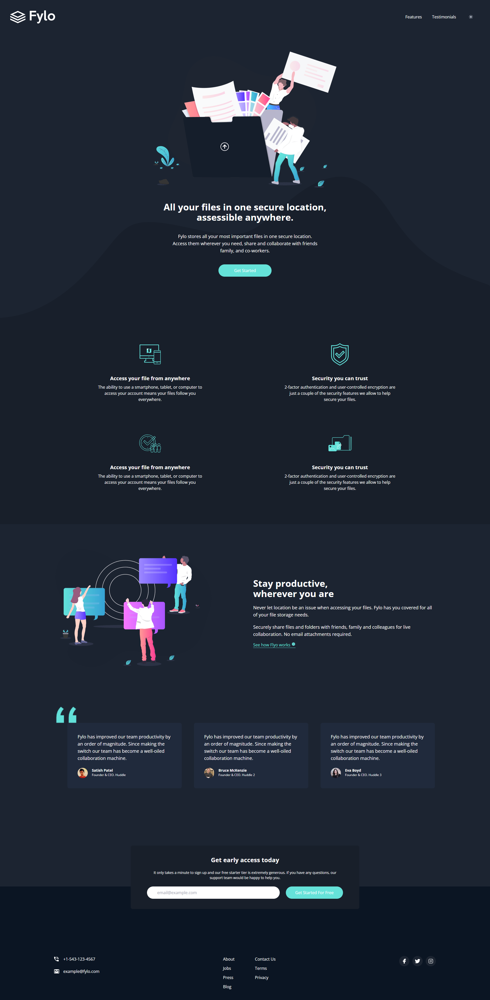
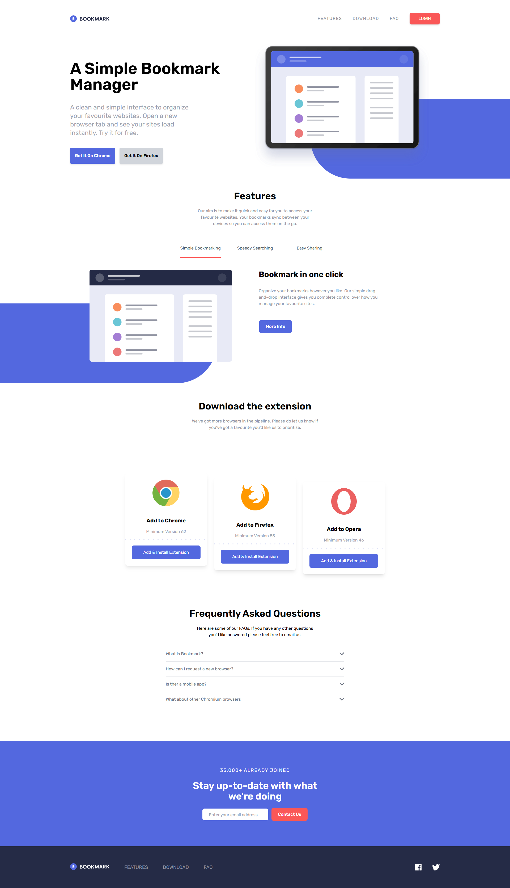

<div align="center">


# Anderson Toledo Martins Moreira

[](https://docs.google.com/document/d/1I8T4Mkb61NsTKN14ZbT1mnQKAc9LqiiPtgrYf9ayH1c/edit?usp=sharing)
[](https://docs.google.com/document/d/1vnFlRP3myxexgHk5Y6XaCKQGETPQwCygPZqGSblwCXg/edit?usp=sharing)
<br/>
[](https://www.linkedin.com/in/atmmoreira)
[](mailto:atmmoreira.rj@gmail.com?subject=From%20GitHub&cc=atmmoreira.rj@gmail&body=Hi,%20there.%20Found%20you%20from%20GitHub.)
[](https://api.whatsapp.com/send?phone=5521992890362)

</div>

<div align="center">


</div>

## Descriptions

This repository its for learn and improve my skills about [TailwindCSS](https://tailwindcss.com/).

- TailwindCSS is a CSS framework that uses low-level 'Utility' classes to create layouts. This is known as a utility-first framework.
- Traditional CSS frameworks like Bootstrap use classes that are directly correlated to components (eg. Alerts, Navbars). TailwindCSS uses classes as utilities to put together to build your our custom components.

## Projects, Images and Descriptions of Screens

- Login Modal - [Demo](https://atmm.dev/courses/tailwindcss/login-modal/) - [Repository](./mini-projects/login-modal)
  

- Product Modal - [Demo](https://atmm.dev/courses/tailwindcss/product-modal/) - [Repository](./mini-projects/product-modal)
  

- Email Subscribe - [Demo](https://atmm.dev/courses/tailwindcss/email-subscribe/) - [Repository](./mini-projects/email-subscribe)
  

- Pricing Cards - [Demo](https://atmm.dev/courses/tailwindcss/pricing-cards/) - [Repository](./mini-projects/pricing-cards)
  

- Image Gallery - [Demo](https://atmm.dev/courses/tailwindcss/image-gallery/) - [Repository](./mini-projects/image-gallery)
  

- Clipboard - [Demo](https://atmm.dev/courses/tailwindcss/clipboard/) - [Repository](./web-projects/clipboard)
  

- LoopStudios - [Demo](https://atmm.dev/courses/tailwindcss/loopstudios/) - [Repository](./web-projects/loopstudios)
  

- Shortly - [Demo](https://atmm.dev/courses/tailwindcss/shortly/) - [Repository](./web-projects/shortly)
  

- Testimonial Grid - [Demo](https://atmm.dev/courses/tailwindcss/testimonial-grid/) - [Repository](./web-projects/testimonial-grid/)
  

- Fylo - [Demo](https://atmm.dev/courses/tailwindcss/fylo/) - [Repository](./web-projects/fylo/)
  

- Bookmark - [Demo](https://atmm.dev/courses/tailwindcss/bookmark/) - [Repository](./web-projects/bookmark/)
  

</div>

## Technologies

<!--
References for Create budgets :: https://shields.io/category/build
Icons: https://simpleicons.org/
-->


### Frameworks and Libraries


### Tools


## Running the project

```bash
# Download or clone the repository.

# Open the project inside your favorite:
I use Visual Studio Code

# To install dependencies of this project, type in the terminal:
`npm install`

# To run this project, type in the terminal:
`npm run start`

# In your favorite Browser, open this URL, to see the Interface.
http://localhost:5173/
```
