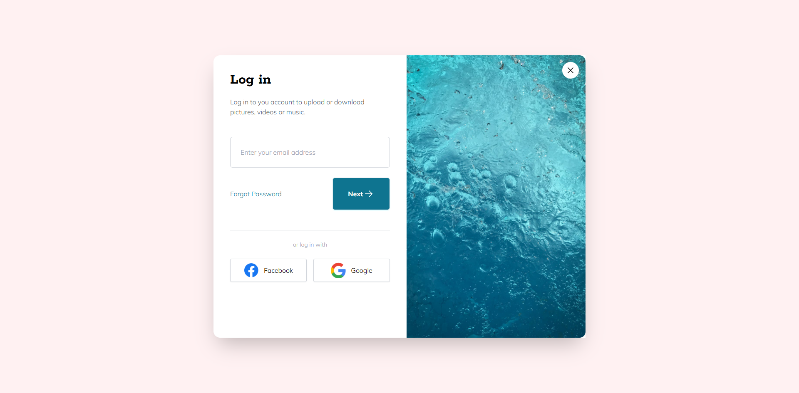
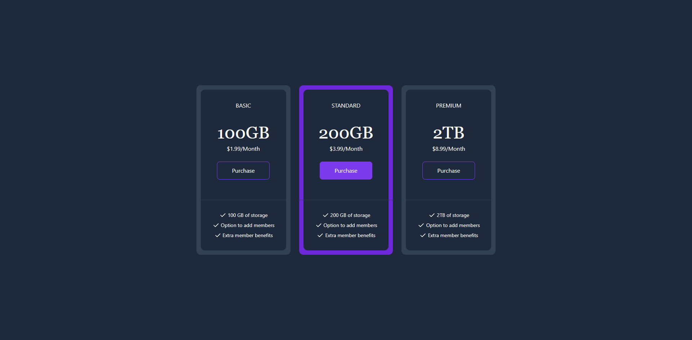

<div align="center">
  
  <h1>Anderson Toledo Martins Moreira</h1>
  <a href="http://www.atmm.dev" target="_blank">Portfolio Online</a>

> Software Developer that love learn and improve your skills in programming languages like CSS (SASS, Bootstrap, TailwindCSS) | JavaScript | React (Next.js) | Typescript | Node (Nest.js) | PHP (Laravel | WordPress), and I started learning about Python and Data Science.

</div>
<br >
<!-- References for Create budgets :: https://shields.io/category/build -->
<div align="center">
  
  <!--  -->
  <!--  -->
  
  <!--  -->
  
  <!-- 
  
  
  
  
  
  
   -->
</div>

<br >

## Descriptions
This repository its for learn and improve my skills about [TailwindCSS](https://tailwindcss.com/).

<div align="center">

### MINI PROJECTS

Login Modal - [Demo](https://login-modal-seven.vercel.app/) - [Repository]("./mini-projects/login-modal")<br><br> 
  
<br><br> Product Modal - [Demo](https://product-modal-rho.vercel.app/) - [Repository]("./mini-projects/product-modal")<br><br> 
  
<br><br> Email Subscribe - [Demo](https://email-subscribe-xi.vercel.app/) - [Repository]("./mini-projects/email-subscribe")<br><br> 
  
<br><br> Pricing Cards - [Demo](https://pricing-cards-beta.vercel.app/) - [Repository]("./mini-projects/pricing-cards")<br><br>
  
<br><br> Image Gallery - [Demo](https://image-gallery-six-pied.vercel.app/) - [Repository]("../mini-projects/image-gallery")<br><br> 
  

### WEB PROJECTS

Clipboard - [Demo](https://clipboard-omega.vercel.app/) - [Repository]("./web-projects/clipboard") <br><br> 
  
<br><br> LoopStudios - [Demo](https://loopstudios-alpha-smoky.vercel.app/) - [Repository]("./web-projects/loopstudios") <br><br> 
  
<br><br> Shortly - [Demo](https://shortly-tau-ten.vercel.app/) - [Repository](./web-projects/shortly) <br><br> 
  
</div>

<br />

## Programming Languages and Frameworks.
```Bash
# TailwindCSS
# HTML5 / CSS3
# Javascript
```

## System Requirements
```Bash
# Git
# Node
```

## Installing and run the project

```bash
# Step 01 
# Download or clone the repository. In this repository has two folder with the projects: mini-projects and web-projects.

# Step 02 
# Open the project inside your favorite IDE (I use VSCode). You can open the entire project, or you can open a specifc folder. Choose the project that you want to see, and follow the steps below.

# Step 03 
# If you have the extension 'Live Server' installed in VSCode.

# Step 04
# Type in the terminal: 'npm i', to install dependencies.

# Step 05
# Type in the terminal: 'npm run watch', to compile the classes of TailwindCSS for each project.

```